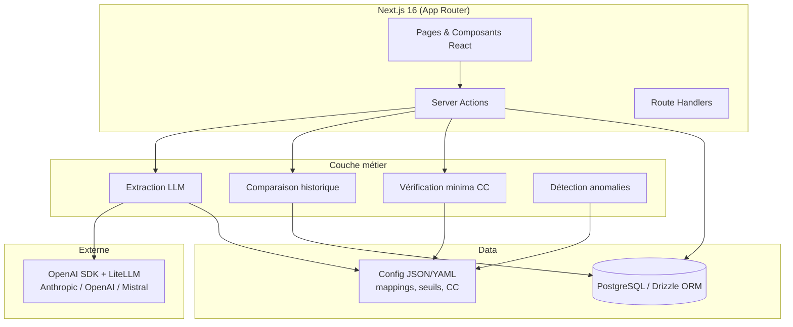

# CLAUDE.md — Analyse des coûts de production audiovisuelle

## Projet

Application web open-source d'analyse des coûts de production audiovisuelle. Destinée aux diffuseurs et sociétés de production qui gèrent des productions externalisées.

L'application permet à une responsable de production d'uploader un devis PDF, d'obtenir une extraction normalisée sur la grille CNC, une vérification de conformité aux conventions collectives, et une comparaison avec l'historique des productions.

## Contexte métier

### Le problème

Un diffuseur gère typiquement des dizaines à centaines de productions externes par an. Chaque devis est reçu au format PDF dans des structures hétérogènes (formats différents selon les producteurs). L'analyse manuelle prend ~60 min par devis. La vérification des minima conventionnels n'est pas systématique. La comparaison avec l'historique se fait souvent à la main dans des tableurs.

### La solution

Un LLM extrait et normalise les données du devis vers la grille CNC (10 catégories standardisées), vérifie les tarifs contre les conventions collectives, et positionne le devis par rapport à l'historique du producteur et à la moyenne globale.

### Résultats attendus

- Extraction des montants : haute précision dès le premier niveau
- Classification CNC : 90-95% avec contexte métier (grille CNC + mapping + CC)
- Gain de temps : ~97% pour un devis structuré (60 min → 2 min)

## Stack technique

| Couche | Choix | Notes |
|--------|-------|-------|
| Framework | Next.js 16+ (App Router, Turbopack) | Fullstack — Server Actions remplacent une API séparée |
| Langage | TypeScript | Partout (front + back) |
| UI | shadcn/ui (@base-ui/react) + Tailwind CSS | Composants accessibles, personnalisables |
| Charts | Recharts | Visualisations dashboard (bar, line, grouped) |
| LLM | OpenAI SDK + LiteLLM proxy | Multi-provider (tout endpoint OpenAI-compatible) |
| PDF text | unpdf (pdfjs-dist) + Mistral OCR fallback | Extraction directe pour PDF texte, OCR pour PDF scannés |
| BDD | PostgreSQL via Drizzle ORM (postgres.js) | Postgres managé ou conteneur local |
| Validation | Zod | Schémas partagés : sortie LLM, API, formulaires |
| Tests | Vitest | ESM natif, rapide, compatible Turbopack |
| Déploiement | Docker Compose ou Kubernetes (chart Helm dans `.infrastructure/`) | Auth OIDC pluggable + mode démo |

### Architecture



### Routes

| Route | Type | Description |
|-------|------|-------------|
| `/` | Server | Dashboard — KPIs, graphe producteurs, derniers devis |
| `/productions` | Server | Liste des productions — table triable, recherche, filtre |
| `/productions/import` | Client | Upload PDF + extraction LLM |
| `/productions/[id]/devis` | Server | Grille CNC (lecture + édition) |
| `/productions/[id]/compliance` | Server | Rapport de conformité CC (6 règles) + commentaires IA |
| `/productions/[id]/comparison` | Server | Comparaison historique : coût/minute, structure CNC, tarifs par poste vs producteur et inter-producteurs, tendance, classement |
| `/review?id={id}` | Server | Relecture/correction d'un brouillon d'extraction avant publication |
| `/analytics` | Redirect | → `/analytics/jobs` |
| `/analytics/jobs` | Server | Tarifs journaliers par métier — table + distribution chart |
| `/analytics/services` | Server | Répartition par catégorie CNC — overview + détail par producteur |
| `/analytics/producers` | Server | Classement producteurs — ranking + profil avec tendances et alertes CC |
| `/analytics/compliance` | Server | Matrice de conformité CC (métier × producteur) |
| `/settings/conventions` | Server | Barèmes CC (consultation + mise à jour) |
| `/settings/thresholds` | Server | Règles de détection (6 règles) et seuils d'alerte |
| `/settings/types` | Server | Types de production |
| `/settings/producers` | Server | Renommage et fusion de producteurs |
| `/settings/mappings` | Server | Correspondances CNC (FR/DE/EN) |
| `/api/extract` | API | Extraction LLM (streaming SSE) — crée un brouillon + stocke le PDF (transitoire, le temps de la relecture) |
| `/api/files/[productionId]` | API | Sert le PDF original d'un **brouillon** (inline). 404 dès que la production est publiée (RGPD) |
| `/api/compliance` | API | Commentaires IA (streaming) + cache GET |

### Layout

- **AppHeader** : barre supérieure avec recherche globale, navigation (Productions / Comparatifs / Paramètres), bouton import
- **Sidebar** : collapsible, affiche les productions du même producteur pour navigation rapide
- **ProductionTabs** : onglets Devis / Conformité / Comparaison dans les pages `[id]/*`
- **AppShell** : shell générique avec slot sidebar, footer sticky, et mode `fullWidth` pour les vues split PDF
- **AnalyticsTabs** : onglets Par métier / Par service / Par producteur / Conformité CC dans `/analytics/*`
- **SettingsTabs** : onglets Conventions collectives / Seuils d'alerte / Types / Producteurs / Correspondances CNC
- **PeriodFilter** : filtre par période (mois) + filtre par type de production dans le layout analytics

### Patterns clés

- Les pages `/productions/[id]/*` sont des **server components** qui chargent depuis la DB via l'ID URL
- Les productions ont un **statut** (`draft` / `published`). L'extraction crée un brouillon ; la validation le publie. Un filtre `PUBLISHED` est appliqué à toutes les requêtes de liste/analytics
- **RGPD** : le PDF source n'est conservé que **transitoirement**, le temps de l'import/relecture. Il est stocké dans `production_files` (bytea, FK CASCADE vers `productions`) uniquement pour les brouillons, visualisable en split-screen sur la page review. À la publication il est **supprimé** (`deleteProductionFile`) ; les brouillons abandonnés > 24h sont purgés à l'extraction suivante (`deleteStaleDrafts`). Les devis publiés n'exposent jamais leur PDF — la route `/api/files/[id]` ne sert que les brouillons (`getDraftProductionFile`)
- La page `/review?id={id}` est un **server component** qui charge le brouillon depuis la DB (résilient au refresh)
- `buttonVariants` est dans `button-variants.ts` (sans `"use client"`) pour être utilisable côté serveur
- `getAllProductions` est wrappé avec React `cache` pour dédupliquer les appels layout + page
- Les productions seedées sont taguées `formatSource: "seed-history"` pour les distinguer des uploads

## Référentiels métier

### Grille CNC (10 catégories)

1. Droits artistiques (auteurs, musique, archives, traduction)
2. Dépenses de personnel (production, réalisation, tournage, montage)
3. Interprétation
4. Charges sociales
5. Décors et costumes
6. Transport, défraiement, régie
7. Moyens techniques de tournage
8. Post-production (montage, étalonnage, mixage)
9. Assurance
10. Imprévus, frais généraux, production déléguée

### Conventions collectives

Référentiel : CAT B — Hors fiction & flux (CDDU, base 8h)
Postes clés avec minima (barème Jan 2025) :

- Directeur de production : 383,39 €/j
- Chargé de production : 240,87 €/j
- Administrateur de production : 219,58 €/j
- Chef OPS / Ingénieur du son : 303,46 €/j
- Mixeur : 337,39 €/j
- Cadreur / OPV : 281,54 €/j
- Chef monteur : 282,12 €/j
- Étalonneur : 241,48 €/j
- Technicien vidéo : 205,85 €/j
- Assistant de production : 178,76 €/j
- Assistant de post-production : 156,67 €/j

120 postes au total dans la grille CC. Seuls les postes clés ci-dessus sont listés. La grille complète est dans la table `cc_minimums` et dans `src/lib/config/cc-minimums.ts`.

Note : les minima CC sont versionnés par date dans la table `cc_minimums`. Les valeurs ci-dessus sont le barème en vigueur (2025-01-01).

### Types de contrat

- `salarie` : personnel embauché en CDDU/CDD (défaut) — soumis aux minima CC
- `prestataire` : prestataire facturant ses services — non soumis
- `etranger` : société étrangère — non soumis
- `forfait` : montant forfaitaire (pas un tarif journalier) — exclu des analytics de tarifs

### Schéma JSON normalisé (UC3-CNC-Devis-v1)

Format de sortie de l'extraction LLM :

```json
{
  "meta": {
    "producteur": "string",
    "titre": "string",
    "duree_minutes": "number",
    "diffuseur": "string",
    "lieu_tournage": "string",
    "type_production": "string",
    "format_source": "string"
  },
  "grille_cnc": {
    "1_droits_artistiques": { ... },
    "2_personnel": { ... },
    "4_charges_sociales": { ... },
    "6_transport": "number",
    "7_tournage": { ... },
    "8_post_production": { ... },
    "9_assurance": "number",
    "10_imprevus_fg_pd": { ... }
  },
  "total_devis": "number",
  "cout_minute": "number",
  "verification_minima": [ ... ],
  "anomalies": [ ... ],
  "postes_non_classes": ["string"],
  "confiance": "haute | moyenne | basse"
}
```

## Backlog

### Epic MVP

- **US-1** ✅ : Analyser un devis en un clic — upload PDF, extraction auto, support FR/DE/EN
- **US-2** ✅ : Relire et corriger l'extraction — tableau CNC, indicateurs de confiance, édition
- **US-3** ✅ : Vérifier la conformité aux conventions collectives — alertes rouge/orange/vert
- **US-4** ✅ : Comparer avec l'historique et les autres producteurs — écarts par catégorie
- **US-5** ✅ : Explorer les coûts par métier, par service et par producteur — vues croisées
- **US-6** ✅ (partiel) : Dashboard (KPIs, graphe, table) — exports (Excel, PDF) restent à faire
- **US-7** ✅ : Gérer les référentiels — CC rates, seuils, types, producteurs, correspondances CNC

### Epic open-source

- **OS-1** ✅ : Externaliser la configuration spécifique à l'organisation (`config/*.json`, branding par env)
- **OS-2** ✅ : Supporter plusieurs providers LLM (endpoint OpenAI-compatible)
- **OS-3** ✅ : Containeriser l'application (Dockerfile, `docker-compose.yml` avec Postgres, chart Helm)
- **OS-4** ✅ : Documentation (README, `docs/`, guide intégré)
- **OS-5** ✅ : Jeu de données de démonstration (`demo-data/`)
- **OS-6** ✅ : Publication GitHub, licence Apache-2.0 et gouvernance (CONTRIBUTING, CODE_OF_CONDUCT, SECURITY)

## Règles de détection d'anomalies (6 règles)

| Code | Règle                     | Condition                                | Sévérité  |
| ---- | ------------------------- | ---------------------------------------- | --------- |
| R1   | Non-conformité minima CC  | Tarif journalier < minimum conventionnel | ÉLEVÉE    |
| R3   | Structure atypique (haut) | Part d'une catégorie > seuil haut        | ATTENTION |
| R4   | Structure atypique (bas)  | Part d'une catégorie < seuil bas         | INFO      |
| R5   | Charges sociales nulles   | Aucune charge sociale déclarée           | ATTENTION |
| R6   | Charges sociales basses   | Taux techniciens < 50%                   | ATTENTION |
| R7   | Coût/minute outlier       | Écart > 30% vs moyenne du producteur     | ATTENTION |

Seuils structurels (% du total) :

- Droits artistiques : 2% — 15%
- Personnel : 15% — 55%
- Charges sociales : 5% — 25%
- Transports : 2% — 25%
- Moyens techniques : 5% — 25%
- Imprévus/FG/PD : 5% — 35%

## Données historiques

**Trois chemins de seed** :

- **`npm run db:seed:demo`** — lit `demo-data/history.json` (25 productions fictives, 6 producteurs fictifs). Idempotent (`formatSource = 'seed-demo'`). C'est le seed des déployeurs externes et de l'instance de démo publique.
- **`npm run db:seed:xlsm`** — lit le tableur de l'organisation (`HISTORY_XLSM_PATH`, défaut `documents/history.xlsm`, dossier gitignored) via `scripts/parse-history-xlsm.ts`. Idempotent (`formatSource = 'seed-history'`). Détecte les forfaits (montants forfaitaires encodés `1 jour × total`). Aucune donnée réelle n'est committée.
- **`npm run db:seed:cc`** — insère le barème CC de `config/cc-minimums.json` (référence publique : CDDU Cat. B, base 8h, 2025-01-01). Variante tableur : `db:seed:cc:xlsm`.

**Régénération du dataset démo** (mainteneurs) : `scripts/anonymize-history-to-demo.ts` lit le tableur réel, renomme les producteurs selon `documents/producer-rename.json` (gitignored — ne jamais committer la correspondance réel → fictif), remplace les titres, échantillonne, écrit `demo-data/history.json`.

`scripts/parse-history-xlsm.ts` est le module de parsing partagé — pas de duplication.

## Pipeline LLM (extraction)

### Extraction texte du PDF
- **Stratégie** : extraction directe d'abord (`unpdf` / pdfjs-dist), fallback Mistral OCR pour les PDF scannés (images)
- **Extraction directe** : 90%+ des devis sont des PDF texte → extraction instantanée (~30ms), gratuite, 100% fidèle
- **Fallback OCR** : Mistral OCR (`mistral-ocr-latest`) pour les PDF sans texte embarqué (scans)
- **Sortie** : texte brut (direct) ou markdown structuré (OCR)

### LLM — Extraction + Classification CNC + analyse
- **Entrée** : texte extrait du PDF
- **Modèle** : `LLM_MODEL` (défaut : Claude Sonnet) — extraction, classification et raisonnement en une passe
- **Contexte injecté** : grille CNC, table de correspondance FR/DE/EN, minima CC, seuils d'anomalie
- **Sortie** : JSON normalisé UC3-CNC-Devis-v1 avec classification, vérification CC, anomalies (streamé)

### Détection des forfaits
Le prompt instruit le LLM à détecter les montants forfaitaires et à les taguer `type_contrat: "forfait"`. Les forfaits sont exclus des calculs de tarifs journaliers moyens dans les analytics.

### Coût estimé
~0,03 €/devis avec Sonnet.

## Authentification

Auth.js v5 avec providers conditionnels selon l'environnement. La logique de sélection est dans `src/lib/auth-config.ts` (testable, pure) ; le wiring NextAuth est dans `src/lib/auth.ts`.

| Variable | Effet |
|----------|-------|
| `AUTH_OIDC_ISSUER` + `AUTH_OIDC_CLIENT_ID` | Active le provider OIDC générique (Keycloak, Auth0, Authentik, etc.) |
| `AUTH_OIDC_CLIENT_SECRET` | Optionnel — laisser vide pour client public + PKCE |
| `AUTH_OIDC_NAME` | Libellé du bouton de connexion (défaut : "SSO") |
| `AUTH_REQUIRED_GROUP` | Restriction par groupe — **obligatoire si OIDC est activé**, sauf opt-out explicite via `AUTH_OIDC_ALLOW_ANY=true` |
| `AUTH_OIDC_ALLOW_ANY=true` | Opt-out explicite : autorise tout utilisateur authentifié via OIDC (à utiliser uniquement si l'IdP ne fournit pas de claim de groupes) |
| `DEMO_MODE=true` | Active le provider Credentials sur `/sign-in` (utilisateur fictif `demo@example.com`, sans mot de passe). Ne JAMAIS activer en production avec de vraies données. Les données de démo se chargent séparément via `npm run db:seed:demo`. |

**Fail-loud** : l'app refuse de démarrer (`throw` au chargement du module) dans deux cas :
1. Aucun provider configuré (ni OIDC ni démo)
2. OIDC configuré sans `AUTH_REQUIRED_GROUP` ni `AUTH_OIDC_ALLOW_ANY=true` — empêche un déploiement où la restriction de groupe a été oubliée et tout utilisateur authentifié peut accéder

L'utilisateur démo n'est pas soumis à la restriction de groupe. Le champ `provider` est stocké dans le JWT et la session pour permettre des branches conditionnelles côté serveur si besoin.

## Persona principal

**Responsable de production**

- Supervise les productions externalisées
- Gère des dizaines de reportages/an avec de multiples producteurs
- Évalue la cohérence des devis par rapport à l'historique
- Vérifie la conformité aux conventions collectives
- Compare les coûts par producteur, par métier, par service
- Pas de compétence technique — l'interface doit être simple (upload, clic, résultat)

## Langues

- Interface : français
- Devis acceptés : FR, DE, EN
- Les intitulés de postes DE/EN doivent être mappés vers la nomenclature CNC
  - Exemples : "Kameramann" (DE) = "Chef opérateur" (FR) = "Director of Photography" (EN)

## Configuration & branding

- **Référentiels** : les valeurs par défaut vivent dans `config/*.json` (types de production, correspondances CNC, minima CC, seuils). Les modules `src/lib/config/*.ts` ne font qu'importer et typer ces fichiers. `APP_CONFIG_DIR` permet de monter des fichiers de remplacement à l'exécution (`src/lib/config/config-dir.ts`). Les valeurs éditées dans l'UI (table `settings`) priment toujours.
- **Branding** : `src/lib/config/branding.ts` lit `APP_NAME`, `APP_BADGE`, `APP_LOGO_URL`, `APP_FAVICON_URL`, `APP_THEME_HUE`, `APP_THEME_CHROMA`, `APP_PRIMARY_COLOR`, `APP_PRIMARY_FOREGROUND_COLOR`, `APP_THEME_CSS_URL`. Aucune intégration tierce nommée dans le code : les widgets (feedback, analytics, chat) se branchent via un fichier `public/custom.js` **gitignored**, ajouté avant le build et embarqué dans l'image comme asset statique ; le layout racine le charge quand il existe. Pas de montage runtime ni de variable d'environnement. Le layout racine pose les variables CSS `--brand-hue` / `--brand-chroma` en inline sur `<html>` ; tous les tokens teintés de `globals.css` en dérivent. Ne jamais coder en dur une couleur de marque ou un nom d'organisation dans les composants.
- **Aucune donnée privée dans le dépôt** : pas de noms d'hôtes, d'IP, d'identifiants de projet cloud, de vrais noms de producteurs ni de fichiers `documents/`. Ce dépôt ne déploie rien : les overlays Helm réels, le `custom.js` et le workflow de déploiement vivent dans un dépôt privé séparé qui dérive son image de celle publiée sur GHCR (`docs/deployment.md`).

## Principes de design open-source

- **Configuration over code** : tout ce qui est spécifique à une organisation (mappings, seuils, types de production, producteurs, marque) doit être dans des fichiers de configuration ou des variables d'environnement, pas dans le code
- **Provider-agnostic** : l'appel LLM passe par le SDK OpenAI connecté à un proxy LiteLLM, supportant tout endpoint OpenAI-compatible (Anthropic, OpenAI, Mistral, Ollama)
- **Docker-first** : `docker-compose up` doit lancer toute la stack
- **`.env.example` pattern** : toutes les variables d'environnement documentées dans `.env.example`, jamais de `.env` commité
- **Secrets hors dépôt** : en production les secrets viennent d'un gestionnaire de secrets (Kubernetes Secret / External Secrets) ou du `.env` du serveur, jamais du dépôt
- **PR template** : checklist légère (tests, docs, pas de secrets) dans `.github/PULL_REQUEST_TEMPLATE.md`
- **Licence** : Apache-2.0 (`LICENSE`)

## Pratiques de développement

### Git workflow

- **Feature branches** : une branche par US (`feat/us1-upload-extraction`, `feat/us2-review-correction`, etc.)
- **Conventional commits** : utiliser toute la gamme (`feat:`, `fix:`, `refactor:`, `test:`, `docs:`, `chore:`, `ci:`, `perf:`, `style:`)
- **Commits petits et fréquents** : chaque commit est un changement atomique et cohérent
- **Docs dans les PRs** : la documentation fait partie du même PR que le code qu'elle documente

### Tests

- **TDD** : écrire le test d'abord, implémenter ensuite. Pour les composants UI en phase de prototypage, écrire les tests alongside plutôt que strictement avant.
- **Tester le comportement, pas l'implémentation** : préférer les tests d'intégration pour les flux API/UI ; les tests unitaires sont appropriés pour la logique métier pure (règles d'anomalies, classification CNC, calculs).
- **Co-location** : les tests sont à côté du fichier testé, avec le pattern `module-name.spec.ts`
- **Même commit** : le test et l'implémentation sont dans le même commit
- **Framework** : Vitest (ESM natif, rapide)

### Code

- **Code et commits en anglais** : le code (variables, fonctions, commentaires) et les messages de commit sont en anglais. Les termes métier français restent en français quand ils sont intraduisibles (`devis`, `grille_cnc`, `producteur`, etc.)
- **Interface en français** : tous les textes visibles par l'utilisateur sont en français
- **Documentation concise** : documenter quand ça apporte de la valeur, ne pas dupliquer l'information, aller à l'essentiel. Utiliser des schémas Mermaid quand c'est pertinent.

