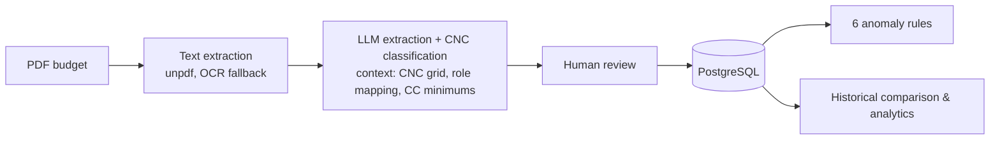

# production-cost-analyzer

**AI-assisted analysis of audiovisual production budgets.**
Upload a producer's budget (PDF, in French, German or English), get it normalised on the
10-category CNC grid, checked against collective-agreement minimum daily rates, and
positioned against your production history — in about two minutes instead of an hour.

Built by [ARTE](https://www.arte.tv/) for broadcasters and production companies that
manage outsourced productions. Released under the Apache 2.0 licence.

> The UI is in French and German. Domain terms (devis, grille CNC, producteur) stay
> French in the code because they have no exact translation.

## Features

- **PDF extraction** — direct text extraction, OCR fallback for scanned documents
- **CNC normalisation** — every budget line classified into the 10 standard CNC categories
- **Collective-agreement checks** — daily rates compared with the CC minimums, versioned by date
- **Anomaly detection** — 6 deterministic rules (CC compliance, atypical cost structure, social
  charges, cost per minute outliers) with configurable thresholds
- **Historical comparison** — cost/minute, cost structure and per-role rates versus the same
  producer and versus all producers
- **Analytics** — by job role, by CNC category, by producer, compliance matrix
- **Review before publish** — human correction step; the source PDF is only kept for the
  duration of the review (privacy by design)
- **Settings UI** — CC rates, thresholds, production types, producer merge/rename, FR/DE/EN role mappings
- **Provider-agnostic LLM** — any OpenAI-compatible endpoint (LiteLLM, OpenAI, Ollama…)
- **White-label** — name, logo, badge, colours and referentials configured per deployment

## Quick start (Docker)

```bash
git clone https://github.com/ArteGEIE/production-cost-analyzer.git
cd production-cost-analyzer
cp .env.example .env        # set LLM_BASE_URL, LLM_API_KEY, MISTRAL_API_KEY
docker compose up
```

Open <http://localhost:3000>, click **Essayer la démo**. PostgreSQL, migrations, the
fictional demo dataset and the CC barème are all handled by Compose. Sample budgets to
upload are in [`demo-data/pdfs/`](demo-data/pdfs/).

## Quick start (local development)

Prerequisites: Node.js 22, PostgreSQL 15+, an OpenAI-compatible LLM endpoint and a Mistral
API key (OCR fallback).

```bash
npm install
cp .env.example .env         # fill in DATABASE_URL, LLM_*, MISTRAL_API_KEY, DEMO_MODE=true
npm run db:migrate           # apply schema migrations
npm run db:seed:cc           # collective-agreement minimums from config/cc-minimums.json
npm run db:seed:demo         # 25 fictional productions
npm run dev                  # http://localhost:3000
```

Other scripts: `npm test`, `npm run lint`, `npm run typecheck`, `npm run build`,
`npm run db:generate` (new migration from schema changes), `npm run db:studio`.

## Configuration

Everything deployment-specific is an environment variable or a JSON file — see
[`docs/configuration.md`](docs/configuration.md) for the full reference.

| Area | How |
|---|---|
| LLM & OCR | `LLM_BASE_URL`, `LLM_API_KEY`, `LLM_MODEL`, `MISTRAL_API_KEY` |
| Authentication | OIDC (`AUTH_OIDC_*`, `AUTH_REQUIRED_GROUP`) or `DEMO_MODE=true` |
| Branding & theme | `APP_NAME`, `APP_LOGO_URL`, `APP_BADGE`, `APP_THEME_HUE`, `APP_PRIMARY_COLOR`, … |
| Referentials | `config/*.json` (production types, CNC role mapping, CC minimums, thresholds), overridable at runtime with `APP_CONFIG_DIR`, editable in the settings UI |
| Your own history | `npm run db:seed:xlsm` from a spreadsheet, or a JSON file in the `demo-data/history.json` shape — see [`docs/data.md`](docs/data.md) |

## Deployment

One container, one PostgreSQL database, any platform you already run. Build the image
from this repository with `docker build`; migrations run with `node scripts/migrate.mjs`
inside it. What the container needs from its environment,
database and reverse proxy is in [`docs/deployment.md`](docs/deployment.md). The Compose
file in the repo is an evaluation stack, not a prescribed setup.

## How it works



Tech stack: Next.js 16 (App Router), TypeScript, Drizzle ORM on PostgreSQL, shadcn/ui +
Tailwind, Recharts, Zod, Vitest, next-intl. Architecture notes for contributors are in
[`CLAUDE.md`](CLAUDE.md).

## Anomaly rules

| Code | Rule | Condition | Severity |
|---|---|---|---|
| R1 | CC minimum violation | daily rate < CC minimum | HIGH |
| R3 | Atypical structure (high) | category share > upper threshold | ATTENTION |
| R4 | Atypical structure (low) | category share < lower threshold | INFO |
| R5 | Zero social charges | none declared | ATTENTION |
| R6 | Low social charges | rate on technician wages < 50 % | ATTENTION |
| R7 | Cost/minute outlier | > 30 % from the producer's average | ATTENTION |

Thresholds live in `config/structural-thresholds.json` and in the settings UI.

## Contributing

Issues and pull requests are welcome. Read [`CONTRIBUTING.md`](CONTRIBUTING.md) for the
workflow (conventional commits, co-located tests, English code / French UI) and
[`SECURITY.md`](SECURITY.md) for reporting vulnerabilities. This project follows the
[Contributor Covenant](CODE_OF_CONDUCT.md).

## Licence

Apache License 2.0 — see [`LICENSE`](LICENSE) and [`NOTICE`](NOTICE).
